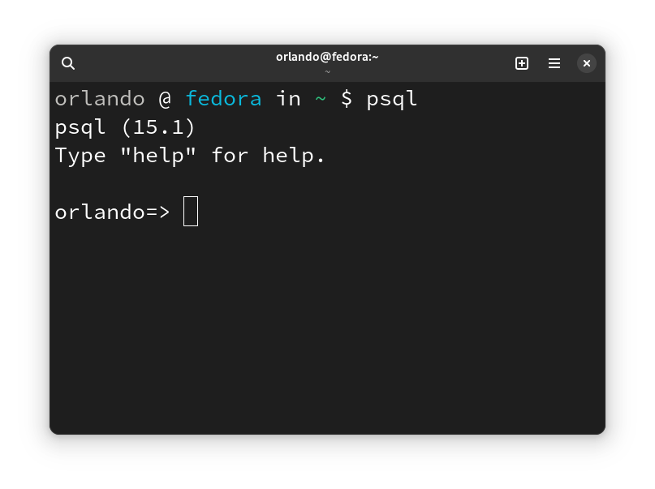

# Databases

_A database is an organized collection of data (also known as a data store) stored and accessed electronically through the use of a database management system_

## Common Types of DBMSs

- Relational Database Management Systems (RDBMS)
  - Stands for Relational Database Management Systems
  - Stores data in tables and requires a fixed schema
  - Examples
    - MySQL
    - **PostgreSQL** (we will be using this database)
    - SQLite
    - Amazon RDS
    - Microsoft SQL Server
    - Microsoft Access
- NoSQL DBMSs
  - Does not utilize SQL and does not require a fixed schema
  - Examples
    - MongoDB
    - Redis
    - Apache CouchDB
    - Cassandra
    - Neo4J

## Postgres Architecture

- Server - the postgres server must be running before a client is able to execute commands 
- Client - connect to a running postgres server

## Basic Concepts

<u>Cluster</u>

_A database cluster is a collection of databases that is managed by a single instance of a running database server_

<u>Schema</u>

_A database schema is considered the “blueprint” of a database which describes how the data may relate to other tables or other data models_

<u>Table (Relation)</u>

_A table is a collection of related data held in a table format within a database. It consists of columns and rows._

<u>Rows (Tuple / Record)</u>

_A data set representing a single item. A row in a table represents a set of related data, and every row in the table has the same structure._

<u>Columns (Attribute / Fields)</u>

_A labeled element of a row. A column is a set of data values of a particular type, one value for each row of the database_

<u>Cell</u>

_The unit where a row and column intersect_

<u>Primary key</u>

_A primary key is a specific choice of a minimal set of attributes (columns) that uniquely specify a record (row) in a table_

## Common Data Types

- integer
- real
- char
- varchar
- text
- date
- time
- timestamp

[Resource](https://www.tutorialspoint.com/postgresql/postgresql_data_types.htm)


## Example

_People Database_

| id    | firstName  |  lastName  | birthdate   | sex      |
| ----- | ---------- | ---------- | ----------- | -------- |
| 1     | Janet      | Wong       | 03/20/1995  | female   |
| 2     | Paul       | Adams      | 07/13/1989  | male     |
| 3     | Matt       | Smith      | 01/05/1966  | male     |
| 4     | Rosalyn    | Martinez   | 10/15/1971  | female   |

## Relationships

_Relationships are a logical connection between different tables (entities), established on the basis of interaction among these tables. These relationships can be modelled as an entity-relationship model_

Types
- One to one - used to relate one record in one table with one record of another table
- One to many - used to relate one record in one table with multiple records of another table
- Many to many - used to relate multiple records in one table with multiple records of another table

Foreign key

_A foreign key is a set of columns in a table that refers to the primary key of another table. The foreign key links these two tables._

[Examples](https://dbdiagram.io/d/64b45c8c02bd1c4a5e29266a)

## SQL

_Structured Query Language (SQL) is one of the languages used to view or change data in databases._

## Creation

Create a new table

```sql
CREATE TABLE people(
  id SERIAL PRIMARY KEY,
  "firstName" VARCHAR(20) NOT NULL,
  "lastName" VARCHAR(20) NOT NULL,
  birthdate DATE,
  sex VARCHAR(6)
);
```

Create a new record

```sql
INSERT INTO people ("firstName", "lastName", birthdate, sex) VALUES ("Bob", "Page", "06/17/2000", "male");
```

## Reading

Retrieve All

```sql
SELECT * FROM people;
```

Retrieve all but only specific columns

```sql
SELECT "firstName", "lastName" FROM people;
```

Retrieve where field matches value

```sql
SELECT birthdate FROM people WHERE sex = "male";
```

## Updating

Updating one cell

```sql
UPDATE people SET lastName = "Jones" WHERE id = 3;
```

Updating multiple columns

```sql
UPDATE people SET firstName = "Michael", lastName = "Jones" WHERE id = 3;
```


## Deleting

Deleting a table

```sql
DROP TABLE people;
```

Deleting a record

```sql
DELETE FROM people WHERE id = 1;
```

## Joins

_The PostgreSQL Joins clause is used to combine records from two or more tables in a database. A JOIN is a means for combining fields from two tables by using values common to each._

Types of Joins

- Inner
- Outer
- Left (Outer)
- Right (Outer)


### SQL Example w/ Join

```sql
SELECT ("firstName", "lastName") 
FROM people 
INNER JOIN "favoriteFood" ON
favoriteFood."personId" = people.id;
```

[SQL Resource](https://www.tutorialspoint.com/postgresql/index.htm)

## psql client

_Command line tool installed alongside PostgreSQL. Allows you to run SQL commands within it_



[Common commands](https://gist.github.com/orlandocaraballo/95f1f9f33c93df4e75d4b230a1290cfa#terminal)

## Gui Clients

- [Postico (Mac only)](https://eggerapps.at/postico2/)
- [Beekeeper Studio](https://www.beekeeperstudio.io/)
- [pgAdmin](https://www.pgadmin.org/download/)