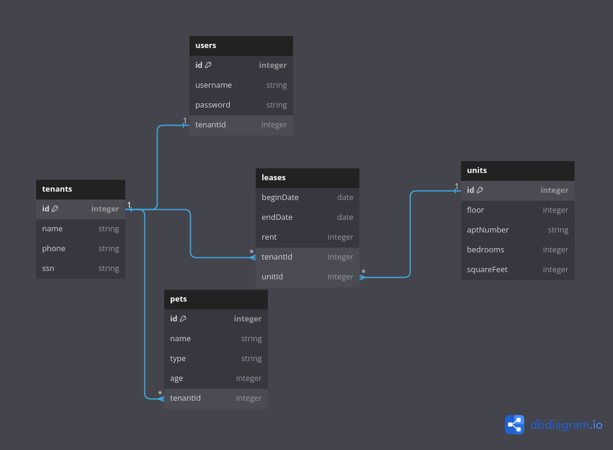

# Let's Build an API

Let's say you are a young upstart capitalist 🎩 🧐 who used their pocket change to buy an apartment building 🏢 in Manhattan. You have tons of money but one problem. It turns out you hired an engineer to handle the client side of your application but now you need an CRUD API to be able to manage your properties.

Here are some requirements:

We need to keep track of the following:

- Tenants
- Their pets
- User accounts
- Leases
- Units

We also need to provide the ability to do the following:

Tenants

- see all
- get information on individual tenants

Leases

- View
- Create
- Remove

(if there's time):

- Add / remove pets
- create user accounts

## Tech Stack

- Express
  - Define our routes
  - Each route needs an HTTP method + pathname
- Sequelize
  - Connect to database
  - Models - have instances (aka fields in db terms)
- PostgreSQL
  - Define our database
  - Define tables - rows (records) and columns (fields)
  - Fields - need datatypes

## Schema

(Link to the Diagram)[https://dbdiagram.io/d/643eb6d16b31947051cd0033]
