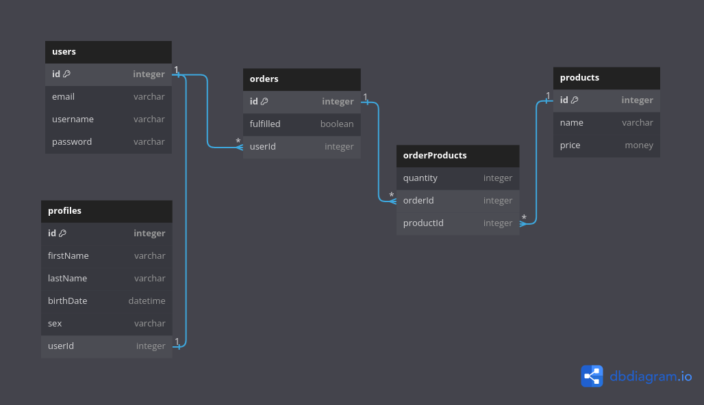

# `Sequelize`

## ORMs

_An ORM is a program used to convert data between incompatible type systems using object-oriented programming languages. This creates a "virtual object database" that can be used from within the programming language._

- Stands for Object Relational Mapper
- Acts as a "bridge" between your code and the RDBMS
- Using an ORM, data can be easily stored and retrieved from a database without writing SQL statements directly

## What is `Sequelize`?

- Sequelize is an Object-Relational Mapper (ORM)
- Access SQL databases from Node.js
- Using JS objects and methods instead of SQL statements
- Represents tables as "classes" and rows as objects (instances)

## `pg` vs `Sequelize`

- Sequelize `model` methods convert our commands into SQL behind the scenes and then...
- Utilizes pg under the hood to communicate with PostgreSQL
- It then converts the `pg` result set into a collection of objects known as `instances`
- We still need to install `pg` alongside `Sequelize`

## Terms

_In Sequelize tables are represented as models and rows are represented as instances_

| SQL Term       | Sequelize equivalent |
| -------------- | -------------------- |
| Table          | Model                |
| Row / Record   | Instance             |
| Column / Field | Instance property    |

## Example

Using `pg` directly

```js
client.query("SELECT * FROM dogs");
client.query("SELECT * FROM cats");
client.query("SELECT * FROM hippos");
```

Using `Sequelize`

```js
Dog.findAll();
Cat.findAll();
Hippo.findAll();
```

## CRUD Operations

Take the following database table

| id  | name          | age |
| --- | ------------- | --- |
| 1   | fido          | 3   |
| 2   | optimus prime | 6   |
| 3   | cassandra     | 1   |
| 4   | meatball      | 4   |

And the following setup code

```js
const Sequelize = require("sequelize");
const db = new Sequelize("postgres://localhost/dogs");
```

### Create

Create a new model / table

```js
const Dog = Sequelize.define("dog", {
  name: Sequelize.STRING,
  age: Sequelize.INTEGER,
});

// actually connects to the database
await Dog.sync();
```

Create a new model / table (alternative)

```js
const Dog = Sequelize.define("dog", {
  name: {
    type: Sequelize.STRING,
    allowNull: false,
  },
  age: {
    type: Sequelize.INTEGER,
  },
});

// actually connects to the database
await Dog.sync();
```

Create a new record

```js
const dog = await Dog.create({
  name: "bear", // makes sense 🤔
  age: 3,
});

console.log(dog); // { id: 5, name: "bear", age: 3 }
```

Create a new record (alternative)

```js
const dog = Dog.new({
  name: "bear", // makes sense 🤔
  age: 3,
});

// this line actually creates the new record
await dog.save();

console.log(dog); // { id: 5, name: "bear", age: 3 }
```

### Read

Find one dog by primary key

```js
// returns a dog instance
const dog = await Dog.findByPk(2); // find 10th dog

console.log(dog.age); // displays dog age to terminal
```

Find all dogs

```js
const dogs = await Dog.findAll();

// returns a array-like object that can be looped thru
dogs.forEach((dog) => console.log(dog.name));

// each element of dogs is a dog instance
```

### Update

```js
const dog = await Dog.findByPk(3);

// we update the dog instance with our new value for name
await dog.update({
  name: "rocko",
});
```

### Delete

```js
const dog = await Dog.findByPk(1);

// deletes the dog from the table
await dog.destroy();
```

## Associations

Take the prior example from some days ago



and let's assume we have created the following models

- `User`
- `Profile`
- `Order`
- `Product`

### One to one

```js
User.hasOne(Profile);
Profile.belongsTo(User);
```

the above ☝🏽 code enables the following functionality

```js
const user = await User.findByPk(1);
await user.getProfile(); // returns the user's profile instance

const profile = await Profile.findByPk(45);
await profile.getUser(); // returns the profile's user instance
```

### One to many

```js
User.hasMany(Order);
Order.belongsTo(User);
```

the above ☝🏽 code enables the following functionality

```js
const user = await User.findByPk(1);
await user.getOrders(); // returns the user's order instances

const order = await Order.findByPk(98);
await order.getUser(); // returns the order's user instance
```

### Many to many

```js
// the through statement is necessary if you want explicitly name
//  your tables (I recommend you follow this strategy)
Order.belongsToMany(Product, through: "orderProducts");
Product.belongsToMany(Order, through: "orderProducts");
```

the above ☝🏽 code enables the following functionality

```js
const order = await Order.findByPk(67);
await order.getProducts(); // returns the order's product instances

const product = await Product.findByPk(14);
await product.getOrders(); // returns the products's user instances
```

## Constraints / Validations

_Constraints and Validations are methods for us to check our data input to see if is in the correct form / structure_

### What's the difference?

- Validations - are checks performed in the Sequelize level, in pure JavaScript
- Constraints - are rules defined at SQL level

Constraint Example

```js
const Dog = Sequelize.define("dog", {
  name: {
    type: Sequelize.STRING,
    allowNull: false,
    unique: true,
  },
  // ...
});
```

Validation Example

```js
const Dog = Sequelize.define("dog", {
  // ...
  age: {
    type: Sequelize.INTEGER,
    validate: {
      min: 1,
      isNumeric: true,
    },
  },
  // ...
});
```
[Sequelize Docs](https://sequelize.org/docs/v6/)