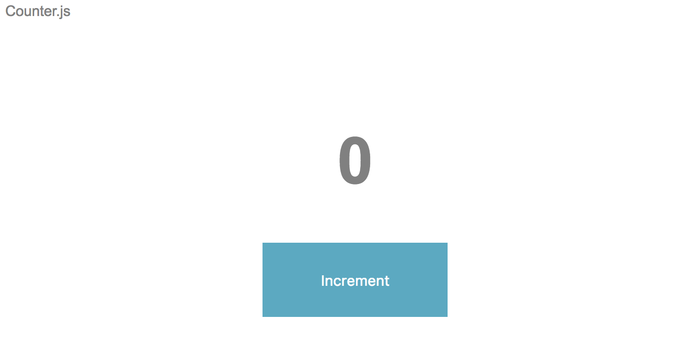

# Lab: Intro to React

### Setup

React is a tool for building interfaces. Throughout the next couple of weeks, we'll discover the many advantages it gives us over using raw DOM manipulation.

Follow these instructions to get started:

1. Clone [this repo](https://github.com/se7en-illa/react-intro) to your computer.
2. Navigate into the project and open it in VSCode.
3. Use the command `npm install` in your terminal to install all of the node modules.
4. Take a moment to review the starting point.

###### What we're building

Our goal is to build a simple app that counts up from 0 when you click a button. It will look something like this:



The subsequent steps will guide you towards this goal.

### The Counter

Before we begin our counter app, we must follow our time-honored tradition of first saying "Hello World".

First, let's check out the dependencies in the package.json:

```json
"dependencies": {
    "react": "^16.2.0",
    "react-dom": "^16.2.0"
},
```

Why both 'react' and 'react-dom'? React is the core library that provides the ability to write components, and ReactDOM is a helper that gives us the ability to take a React component and transform it into real DOM elements. They're separate libraries because the DOM isn't the only environment where we could use React to write a UI! For example, we could use React to describe a native mobile UI for iOS or Android using 'react-native'!

- `npm start` and open `http://localhost:8080/` in your browser (you should see a blank page)

The `npm start` script will begin a special, development-only server called `webpack-dev-server`, which will automatically compile your client JavaScript files (based on the webpack config) and run a small server that sends your `index.html`, `bundle.js` and any other requested file. It will also watch for any changes you make and automatically refresh the page with the new bundle, so you can just leave it running while you work. Isn't that great?

If you are still concerned about your understanding of the way that `webpack` performs its magic, we ask you to put those concerns aside for now - it's much more important to become familiar with React.

- In `app/index.js`, import both React and ReactDOM like so:

```javascript
import React from "react";
import ReactDOM from "react-dom";
```

- Render an h1 tag into the DOM by adding the following code to index.js:

```javascript
ReactDOM.render(<h1>Hello World</h1>, document.getElementById("app"));
```

That's JSX! It's a special syntax extension that React uses - we're only able to use it because our client-side JavaScript is compiled into the browser-safe `bundle.js` first (note that `webpack-dev-server` does this automatically for us). If you're still uncomfortable with JSX, read [this section of the React docs](https://react.dev/learn/writing-markup-with-jsx)

- Refresh the page in your browser - you should see "Hello World" rendered out to the page

#### Initial Render

Now that we've said our hellos, let's write our first real component. A React component can be written in two ways: as a function, or a class. For now, we'll explore writing components using classes.

- In your `index.js`, write the following component. Be sure to add it before `ReactDOM.render`.

All class components extend the `React.Component` class. Note that all of the JSX describing our view is being returned by a method on the class called `render`. This is a special method that all class components must have.

```javascript
class Counter extends React.Component {
  render() {
    return (
      <div id="container">
        <div id="navbar">Counter.js</div>
        <div id="counter">
          <h1>0</h1>
          <button>Increment</button>
        </div>
      </div>
    );
  }
}
```

- Render your `Counter` component to the DOM by swapping it in as the first argument to your `ReactDOM.render`. Note that we write the component as a self-closing JSX tag.

```javascript
ReactDOM.render(<Counter />, document.getElementById("app"));
```

- When the page refreshes your view should look similar to our goal.

However, right now our view is inert - nothing happens when we click the button. In the next step, we'll learn how to add interactivity.

### Dynamic Content

Changes in the view of a React component are always described by state. This forces us to think about about our UI in terms of the data it presents. Think for a moment: what should change about the view in our Counter app as users interact with it, and how could we represent that with data?

The thing that changes in our UI is the number representing the count. We can represent this as a JavaScript number. Let's add state to our component, and some behavior that will cause that state to change.

- Add a `constructor` to your `Counter` class and define state on the component like so. Note that `state` is always a JavaScript object. Individual pieces of state (like our count) are added as key-value pairs on that object.

```javascript
constructor () {
  super()
  this.state = {
    count: 0
  }
}
```

Also note: we need to call `super()` because our `Counter` class is extending the `React.Component` class!

Now let's write a new method on our component that it can use to update `this.state`. However, remember that `this.state` is immutable - we must never modify it directly! Instead, we must ask React (politely) to make the update for us using `this.setState`.

- Add a new method to the `Counter` class, called "increment". It should look like this:

```javascript
increment () {
  this.setState({
    count: this.state.count + 1
  })
}
```

If you thought to write something like `this.state.count++`, that won't work! Take a moment to think about why.

Now we're ready to include the value on our state when we render, and attach the "increment" function to the button's click listener. In JSX, we use a single pair of curly braces to evaluate a JavaScript expression.

Render `this.state.count` into the place where the count should go, and attach "increment" as the callback to the button's `onClick` event like so:

```javascript
render () {
  return (
    <div id='container'>
      <div id='navbar'>
        Counter.js
      </div>
      <div id='counter'>
        <h1>{this.state.count}</h1>
        <button onClick={this.increment}>Increment</button>
      </div>
    </div>
  )
}
```

- Once the page refreshes, try clicking the button to increment the counter.

...It didn't work!?! Yup, sorry. We've encountered a common stumbling block with React. Let's take a moment to understand what's wrong.

- Open your Dev Tools. What error did you receive? Based on the error, what seems to be the problem?

<details>
<summary>Hint: The Problem</summary>

The problem is `this` context! In our "increment" method, we use `this.setState`. However, when the "increment" function is invoked by the `onClick` listener, it will be invoked without its proper `this` context.

We can fix this by `binding` the context of "increment". We could do this in the call to render, but because the "render" method will be called every time the state updates, this means we'll end up creating a lot of function objects over time (they'll be garbage collected eventually, but it's still not ideal). A better strategy is to `bind` the method on the constructor of the component. This way, we only ever create one bound version of the method.

</details>

- Bind the `this` context of "increment" to be the context of the component in the constructor, like so:

```javascript
constructor () {
  super()
  this.state = {
    count: 0
  }
  this.increment = this.increment.bind(this)
}
```

Once the page refreshes, try clicking the button again.

Now it works! You can count!

### Review 1: Prompt

Write down, in as much detail as possible, what happens when the "increment" button is clicked. Don't peek at the answer until you've taken a shot at it!

<details>
<summary>Hint: When the increment button is clicked</summary>

A possible description of the data flow would be as follows:

- The `onClick` listener invokes our bound "increment" function
  = Our "increment" function asks the `Counter` component to update its state by invoking `this.setState`
- The `Counter` component generates a new state object by merging the requested change into the previous state, and reassigns `this.state` to be that new state object
- The `Counter` component executes its "render" method with the new state

When we update the state on a component, that component re-renders. This is the fundamental way that data flows in React!

</details>

### Review 2: The First Law

Notice how in the previous example, we initialized state in the constructor to be `this.state = { count: 0 }`? It was actually pretty important that we gave our state some default value. Why wouldn't we want to to initialize the state to be something like `this.state = { count: null }` or `this.state = {}`?

Consider the difference between the following constructors:

```javascript
constructor () {
  super()
  this.state = {
    favoritePuppy: {},
    allPuppies: [],
    numberOfDogTreatsRemaining: 0,
    ownerName: ''
  }
}
```

vs.

```javascript
constructor () {
  super()
  this.state = {
    favoritePuppy: null,
    allPuppies: null,
    numberOfDogTreatsRemaining: null,
    ownerName: null
  }
}
```

Which code would you rather maintain? By initializing your state object with default values, you self-document the types of data being held on state. That's pretty useful!

What's more, when we initialize our types properly, we implicitly guard against TypeErrors. Consider the following:

```javascript
constructor () {
  super()
  this.state = { kittens: [] } // no kittens yet
}

render () {
  return (
    <div>
      { this.state.kittens.map(kitten => <div>{kitten.name}</div>) }
    </div>
  );
}
```

In this example, we don't have any kittens (perhaps we're going to get them from our server later). However, our render method can safely and declaratively use `Array.prototype.map` without fear of a TypeError (this wouldn't be the case if `this.state.kittens` was initialized to null or undefined!)

THE FIRST LAW: STATE MUST ALWAYS BE INITIALIZED WITH THE APPROPRIATE DATA TYPE
Never break The First Law - always initialize your state appropriately!
